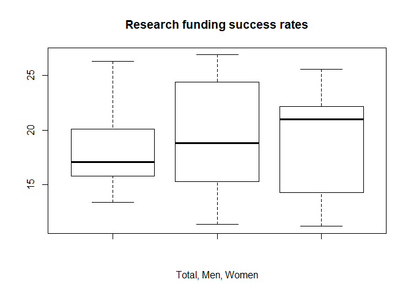

Statistical Tests
================

Chi-square Test
---------------

Load the data

``` r
load("rdas/research_funding_rates.rda") 
```

``` r
research_funding_rates
```

    ##            discipline applications_total applications_men
    ## 1   Chemical sciences                122               83
    ## 2   Physical sciences                174              135
    ## 3             Physics                 76               67
    ## 4          Humanities                396              230
    ## 5  Technical sciences                251              189
    ## 6   Interdisciplinary                183              105
    ## 7 Earth/life sciences                282              156
    ## 8     Social sciences                834              425
    ## 9    Medical sciences                505              245
    ##   applications_women awards_total awards_men awards_women
    ## 1                 39           32         22           10
    ## 2                 39           35         26            9
    ## 3                  9           20         18            2
    ## 4                166           65         33           32
    ## 5                 62           43         30           13
    ## 6                 78           29         12           17
    ## 7                126           56         38           18
    ## 8                409          112         65           47
    ## 9                260           75         46           29
    ##   success_rates_total success_rates_men success_rates_women
    ## 1                26.2              26.5                25.6
    ## 2                20.1              19.3                23.1
    ## 3                26.3              26.9                22.2
    ## 4                16.4              14.3                19.3
    ## 5                17.1              15.9                21.0
    ## 6                15.8              11.4                21.8
    ## 7                19.9              24.4                14.3
    ## 8                13.4              15.3                11.5
    ## 9                14.9              18.8                11.2

Plot research funding success rates: Total, Men, Women

``` r
boxplot(research_funding_rates$success_rates_total,research_funding_rates$success_rates_men, 
     research_funding_rates$success_rates_women, xlab=c("Total, Men, Women"), 
     main ="Research funding success rates")
```



``` r
summary(research_funding_rates)
```

    ##                discipline applications_total applications_men
    ##  Chemical sciences  :1    Min.   : 76.0      Min.   : 67.0   
    ##  Earth/life sciences:1    1st Qu.:174.0      1st Qu.:105.0   
    ##  Humanities         :1    Median :251.0      Median :156.0   
    ##  Interdisciplinary  :1    Mean   :313.7      Mean   :181.7   
    ##  Medical sciences   :1    3rd Qu.:396.0      3rd Qu.:230.0   
    ##  Physical sciences  :1    Max.   :834.0      Max.   :425.0   
    ##  (Other)            :3                                       
    ##  applications_women  awards_total      awards_men     awards_women  
    ##  Min.   :  9        Min.   : 20.00   Min.   :12.00   Min.   : 2.00  
    ##  1st Qu.: 39        1st Qu.: 32.00   1st Qu.:22.00   1st Qu.:10.00  
    ##  Median : 78        Median : 43.00   Median :30.00   Median :17.00  
    ##  Mean   :132        Mean   : 51.89   Mean   :32.22   Mean   :19.67  
    ##  3rd Qu.:166        3rd Qu.: 65.00   3rd Qu.:38.00   3rd Qu.:29.00  
    ##  Max.   :409        Max.   :112.00   Max.   :65.00   Max.   :47.00  
    ##                                                                     
    ##  success_rates_total success_rates_men success_rates_women
    ##  Min.   :13.4        Min.   :11.4      Min.   :11.20      
    ##  1st Qu.:15.8        1st Qu.:15.3      1st Qu.:14.30      
    ##  Median :17.1        Median :18.8      Median :21.00      
    ##  Mean   :18.9        Mean   :19.2      Mean   :18.89      
    ##  3rd Qu.:20.1        3rd Qu.:24.4      3rd Qu.:22.20      
    ##  Max.   :26.3        Max.   :26.9      Max.   :25.60      
    ## 

Compute the totals that were successful and the totals that were not as follows:

``` r
totals <- research_funding_rates %>%  select(-discipline) %>% summarize_all(funs(sum)) %>%  
  summarize(yes_men = awards_men, no_men = applications_men - awards_men, yes_women = awards_women,              
            no_women = applications_women - awards_women)
totals
```

    ##   yes_men no_men yes_women no_women
    ## 1     290   1345       177     1011

Larger percent of men than women received awards

``` r
totals %>% summarize(percent_men = yes_men/(yes_men+no_men),                      
                       percent_women = yes_women/(yes_women+no_women)) 
```

    ##   percent_men percent_women
    ## 1     0.17737     0.1489899

Percent funding when randomly assigned

``` r
funding_rate <- totals %>%  summarize(percent_total = 
                    (yes_men + yes_women)/(yes_men + no_men +yes_women + no_women)) %>% .$percent_total
funding_rate
```

    ## [1] 0.1654269

Chi-square test is to compare any signficant difference between the groups with the help of a two-by-two table

Create the two-by-two Observed data table:

``` r
Observed_data <- data.frame(awarded = c("no", "yes"),                       
                           men = c(totals$no_men, totals$yes_men),                      
                           women = c(totals$no_women, totals$yes_women))
Observed_data
```

    ##   awarded  men women
    ## 1      no 1345  1011
    ## 2     yes  290   177

Have a look at the two-by-two expected data table:

``` r
Expected_data <- data.frame(awarded = c("no", "yes"),      
             men = (totals$no_men + totals$yes_men) * c(1 - funding_rate, funding_rate),        
             women = (totals$no_women + totals$yes_women)*c(1 - funding_rate, funding_rate))
Expected_data
```

    ##   awarded       men    women
    ## 1      no 1364.5271 991.4729
    ## 2     yes  270.4729 196.5271

The idea is to compare the observed to expected.

``` r
chisq_test <- Observed_data %>% select(-awarded) %>% chisq.test()
chisq_test
```

    ## 
    ##  Pearson's Chi-squared test with Yates' continuity correction
    ## 
    ## data:  .
    ## X-squared = 3.8111, df = 1, p-value = 0.05091

``` r
qchisq(0.95,df=1)
```

    ## [1] 3.841459

H0 is There is no difference beween the groups

H1 is there is difference between the groups

Pvalue is &gt;0.05 at 95% significance level. So Ho cannot be rejected.

The Chisquare value of 3.8111 wont cross the critical value at 95% signifcance level for df=1 is 3.841459, so H0 cannot be rejected

Conclusion is that there is no difference between the groups

### Odds Ratio

``` r
odds_men <- (Observed_data$men[2] / sum(Observed_data$men)) / (Observed_data$men[1] / sum(Observed_data$men))
odds_women <- (Observed_data$women[2] / sum(Observed_data$women)) / (Observed_data$women[1] / sum(Observed_data$women))
odds_ratio <- odds_men / odds_women
odds_ratio
```

    ## [1] 1.231554

Larger sample size will give lesser p-value but odds ratio remains same.

### Confidence interval for Odds Ratio

``` r
log_or <- log( odds_men / odds_women ) 
se <- Observed_data %>%  select(-awarded) %>% summarize(se = sqrt(sum(1/men) + sum(1/women))) %>%  .$se 
ci <- log_or + c(-1,1) * qnorm(0.975) * se 
ci
```

    ## [1] 0.004303265 0.412250970

Fisher's Test
-------------

Similar to chisquare test used when sample size is very small &lt;5

Fisher's test with lady tasing tea for milk poured before or after tea was poured.

``` r
tab <- matrix(c(3,1,1,3),2,2) 
rownames(tab)<-c("Poured Before","Poured After") 
colnames(tab)<-c("Guessed before","Guessed after") 
tab
```

    ##               Guessed before Guessed after
    ## Poured Before              3             1
    ## Poured After               1             3

Idea is test actual to guess really works or was it just random happening

``` r
fisher.test(tab)
```

    ## 
    ##  Fisher's Exact Test for Count Data
    ## 
    ## data:  tab
    ## p-value = 0.4857
    ## alternative hypothesis: true odds ratio is not equal to 1
    ## 95 percent confidence interval:
    ##    0.2117329 621.9337505
    ## sample estimates:
    ## odds ratio 
    ##   6.408309

``` r
fisher.test(tab, alternative="greater") 
```

    ## 
    ##  Fisher's Exact Test for Count Data
    ## 
    ## data:  tab
    ## p-value = 0.2429
    ## alternative hypothesis: true odds ratio is greater than 1
    ## 95 percent confidence interval:
    ##  0.3135693       Inf
    ## sample estimates:
    ## odds ratio 
    ##   6.408309

H0 is that there is no difference

H1 is that there is difference between groups

p-value is &gt;0.05 so H0 cannot be rejected. It cannot be said with statistical sig that the lady can actucally guess.

When sample size increase p-vlaue gets reduced but odd ratio remains same.

McNemar Test
------------

McNemar test for paired data

``` r
x<-matrix(c(21,9,2,12),2,2)
mcnemar.test(x)
```

    ## 
    ##  McNemar's Chi-squared test with continuity correction
    ## 
    ## data:  x
    ## McNemar's chi-squared = 3.2727, df = 1, p-value = 0.07044

``` r
mcnemar.test(x,correct=FALSE)
```

    ## 
    ##  McNemar's Chi-squared test
    ## 
    ## data:  x
    ## McNemar's chi-squared = 4.4545, df = 1, p-value = 0.03481

The argument correct = FALSE is a logical indicating whether to apply continuity correction when computing the test statistic.

``` r
mcnemar.exact(x)
```

    ## 
    ##  Exact McNemar test (with central confidence intervals)
    ## 
    ## data:  x
    ## b = 2, c = 9, p-value = 0.06543
    ## alternative hypothesis: true odds ratio is not equal to 1
    ## 95 percent confidence interval:
    ##  0.02336464 1.07363844
    ## sample estimates:
    ## odds ratio 
    ##  0.2222222
