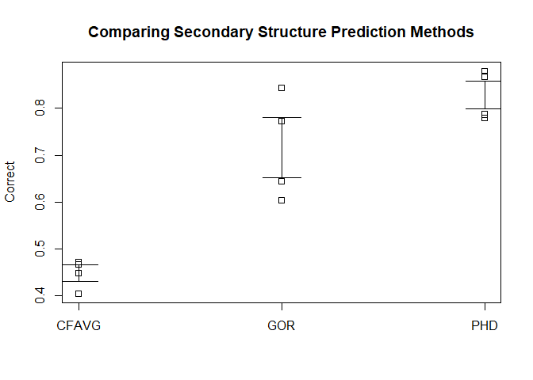

Statistical test
================

### One proportion sample test

An experiment crossing flowers of two genotypes that produce progeny with white flowers (recessive) of assumed proportion ¼ and progeny with purple flowers (dominant) of assumed proportion ¾. Test the assumption (null hypothesis) that these proportions are correct given that we have empirical data from 900 plants, 625 of which have purple flowers, and the remainder (275) have white flowers.

x=number of successes (purple flowers), n=total in sample, and p=proportion of successes to be tested (3/4).

H0 = proportion of success equals 3/4, H1= proportion of success not equal to 3/4

prop.test() and binom.test() are used to compare the proportion. prop.test() is used when sample size is &gt;30. The function returns the value of Pearson's chi-squared test statistic, a p-value, a 95% confidence intervals, an estimated probability of success

Binomial test "is an exact test of a simple null hypothesis about the probability of success in a Bernoulli experiment". The exact test of a binomial hypothesis, usually done when sample with small sample size.

``` r
prop.test(x=625, n=900, p = 3/4, alternative = "two.sided",
          correct = TRUE)
```

    ## 
    ##  1-sample proportions test with continuity correction
    ## 
    ## data:  625 out of 900, null probability 3/4
    ## X-squared = 14.52, df = 1, p-value = 0.0001387
    ## alternative hypothesis: true p is not equal to 0.75
    ## 95 percent confidence interval:
    ##  0.6630075 0.7241981
    ## sample estimates:
    ##         p 
    ## 0.6944444

``` r
binom.test(x=625,n=900,p=3/4) 
```

    ## 
    ##  Exact binomial test
    ## 
    ## data:  625 and 900
    ## number of successes = 625, number of trials = 900, p-value =
    ## 0.0001593
    ## alternative hypothesis: true probability of success is not equal to 0.75
    ## 95 percent confidence interval:
    ##  0.6631931 0.7244169
    ## sample estimates:
    ## probability of success 
    ##              0.6944444

95% confidence interval for the proportion of successes lies between 0.663 and 0.724. Hypothesized value of 0.75 is outside the 95% confidence interval. Also p-value &lt;0.05, H0 is rejected. There is a statistical diff in the observed and expected proportions of flowers.

Two proportion sample test
--------------------------

Compare the proportions of smokers in the two groups of individuals:

lung cancer = 500, smokers = 490

healthy = 500, smokers = 400

``` r
prop.test(x = c(490, 400), n = c(500, 500))
```

    ## 
    ##  2-sample test for equality of proportions with continuity
    ##  correction
    ## 
    ## data:  c(490, 400) out of c(500, 500)
    ## X-squared = 80.909, df = 1, p-value < 2.2e-16
    ## alternative hypothesis: two.sided
    ## 95 percent confidence interval:
    ##  0.1408536 0.2191464
    ## sample estimates:
    ## prop 1 prop 2 
    ##   0.98   0.80

p-value&lt;0.05, It can be concluded that there is difference between groups

Test whether the proportion of smokers is less in the cancer group

``` r
prop.test(x = c(490, 400), n = c(500, 500), alternative = "less") 
```

    ## 
    ##  2-sample test for equality of proportions with continuity
    ##  correction
    ## 
    ## data:  c(490, 400) out of c(500, 500)
    ## X-squared = 80.909, df = 1, p-value = 1
    ## alternative hypothesis: less
    ## 95 percent confidence interval:
    ##  -1.0000000  0.2131742
    ## sample estimates:
    ## prop 1 prop 2 
    ##   0.98   0.80

p-value&gt;0.05, cancer group is not having less proportion of smokers than healthy

``` r
prop.test(x = c(490, 400), n = c(500, 500),
          alternative = "greater")
```

    ## 
    ##  2-sample test for equality of proportions with continuity
    ##  correction
    ## 
    ## data:  c(490, 400) out of c(500, 500)
    ## X-squared = 80.909, df = 1, p-value < 2.2e-16
    ## alternative hypothesis: greater
    ## 95 percent confidence interval:
    ##  0.1468258 1.0000000
    ## sample estimates:
    ## prop 1 prop 2 
    ##   0.98   0.80

p-value&lt;0.05 cancer group has more proportion of smokers than healthy group.

Standard chi-square test in chisq.test() is exactly equivalent to prop.test() but it works with data in matrix form.

One sample t-Test
-----------------

The sample mean is tested for a hypothesised value here.

Gene expression of few genes are noted in the dataset

``` r
load("rdas/geHTdata.rda")
head(geHTdata)
```

    ##   names   c1   t1   c2   t2   c3   t3   c4   t4
    ## 1 Gene1 2650 3115 2619 2933 2331 2799 2750 3200
    ## 2 Gene2 1200 1101 1200 1309 1888 1901 1315  980
    ## 3 Gene3 1541 1358 1401 1499 1256 1238 1625 1421
    ## 4 Gene4 1545 1910 1652 2028 1449 1901 1399 2002
    ## 5 Gene5 1956 2999 2066 2880 1777 2898 1999 2798
    ## 6 Gene6 1599 2710 1754 2765 1434 2689 1702 2402

Create data vector of all control data

``` r
controls<-c(geHTdata$c1,geHTdata$c2,geHTdata$c3,geHTdata$c4)
head(controls)
```

    ## [1] 2650 1200 1541 1545 1956 1599

Perform one-sample t-test to check the true mean of the sample is 2000

H0 is the mean is 2000

``` r
t.test(controls,mu=2000) 
```

    ## 
    ##  One Sample t-test
    ## 
    ## data:  controls
    ## t = -2.174, df = 39, p-value = 0.03583
    ## alternative hypothesis: true mean is not equal to 2000
    ## 95 percent confidence interval:
    ##  1715.028 1989.722
    ## sample estimates:
    ## mean of x 
    ##  1852.375

The p-value of 0.03583 rejects the null hypothesis at a critical value (alpha level) of 0.05

Two sample t-test
-----------------

One sample tested here is the "controls". Create the next sample, "treatment".

``` r
treatments<-c(geHTdata$t1, geHTdata$t2, geHTdata$t3, geHTdata$t4)
head(treatments)
```

    ## [1] 3115 1101 1358 1910 2999 2710

To compare the sample means of control and treatment

H0 is there is no difference between mean of 2 groups

``` r
t.test(controls,treatments) 
```

    ## 
    ##  Welch Two Sample t-test
    ## 
    ## data:  controls and treatments
    ## t = -3.6163, df = 70.732, p-value = 0.0005564
    ## alternative hypothesis: true difference in means is not equal to 0
    ## 95 percent confidence interval:
    ##  -653.6098 -188.9902
    ## sample estimates:
    ## mean of x mean of y 
    ##  1852.375  2273.675

p-value for this test very strongly rejects the null hypothesis that there is no difference between the mean of the treatment group and control group. Some genes exhibit significantly different gene expression levels in treatments n control groups

Paired T test
-------------

To compare the paired values of 2 groups, controls and treatments

``` r
t.test(controls,treatments, paired = TRUE) 
```

    ## 
    ##  Paired t-test
    ## 
    ## data:  controls and treatments
    ## t = -6.3945, df = 39, p-value = 1.468e-07
    ## alternative hypothesis: true difference in means is not equal to 0
    ## 95 percent confidence interval:
    ##  -554.5654 -288.0346
    ## sample estimates:
    ## mean of the differences 
    ##                  -421.3

The p-value for the test indicates there is a significant difference in gene expression in the paired data of controls and treatments and the null hypothesis is rejected.

ANOVA
-----

One way Analysis of variance compare more than 2 groups, parametric

Load the data

Dataset shows different method for identifying protiens and the accuracy.

``` r
load("rdas/protStruct.rda")
head(protStruct)
```

    ##     Protein Method Correct
    ## 1 Ubiquitin  CFAVG   0.467
    ## 2 Ubiquitin    GOR   0.645
    ## 3 Ubiquitin    PHD   0.868
    ## 4   DeoxyHb  CFAVG   0.472
    ## 5   DeoxyHb    GOR   0.844
    ## 6   DeoxyHb    PHD   0.879

``` r
str(protStruct)
```

    ## 'data.frame':    12 obs. of  3 variables:
    ##  $ Protein: Factor w/ 4 levels "DeoxyHb","Prealbumin",..: 4 4 4 1 1 1 3 3 3 2 ...
    ##  $ Method : Factor w/ 3 levels "CFAVG","GOR",..: 1 2 3 1 2 3 1 2 3 1 ...
    ##  $ Correct: num  0.467 0.645 0.868 0.472 0.844 0.879 0.405 0.604 0.787 0.449 ...

One way ANOVA analysis tells us whether there is a significant difference between 3 or more groups at one factor levels

``` r
anova(lm(Correct~Method,data=protStruct)) 
```

    ## Analysis of Variance Table
    ## 
    ## Response: Correct
    ##           Df   Sum Sq  Mean Sq F value    Pr(>F)    
    ## Method     2 0.305352 0.152676  28.581 0.0001263 ***
    ## Residuals  9 0.048077 0.005342                      
    ## ---
    ## Signif. codes:  0 '***' 0.001 '**' 0.01 '*' 0.05 '.' 0.1 ' ' 1

Residuals refers to the sum of squares between by the group name (method row) and the sum of squares within as part of the "residuals" row.

There is difference between the performance of the protein identification methods.

Determine which methods differ with pairwise.t.test function.

``` r
pairwise.t.test(protStruct$Correct,protStruct$Method)
```

    ## 
    ##  Pairwise comparisons using t tests with pooled SD 
    ## 
    ## data:  protStruct$Correct and protStruct$Method 
    ## 
    ##     CFAVG   GOR    
    ## GOR 0.00115 -      
    ## PHD 0.00013 0.05793
    ## 
    ## P value adjustment method: holm

No difference between the GOR and PHD methods but that both of these differ significantly from the CF AVG method.

Pariwise t-test with different method for p-value adjustment, Using false discovery rate fdr

``` r
pairwise.t.test(protStruct$Correct,protStruct$Method,p.adj="fdr")
```

    ## 
    ##  Pairwise comparisons using t tests with pooled SD 
    ## 
    ## data:  protStruct$Correct and protStruct$Method 
    ## 
    ##     CFAVG   GOR    
    ## GOR 0.00086 -      
    ## PHD 0.00013 0.05793
    ## 
    ## P value adjustment method: fdr

Graph for ANOVA

``` r
stripchart(Correct~Method, vert=T, data= protStruct)
title("Comparing Secondary Structure Prediction Methods") 
#Calculating group means, sd, and sem 
xbar<-tapply(protStruct$Correct,protStruct$Method,mean) 
s<-tapply(protStruct$Correct,protStruct$Method,sd) 
sem<-s/sqrt(12) 
arrows(1:3,xbar+2*sem,1:3,xbar-2*sem,angle=90,code=3) 
```



Two way ANOVA
-------------

To compare the groups with 2 factor levels

``` r
anova(lm(Correct~Method+Protein, data=protStruct)) 
```

    ## Analysis of Variance Table
    ## 
    ## Response: Correct
    ##           Df   Sum Sq  Mean Sq F value    Pr(>F)    
    ## Method     2 0.305352 0.152676 42.6844 0.0002832 ***
    ## Protein    3 0.026615 0.008872  2.4803 0.1583825    
    ## Residuals  6 0.021461 0.003577                      
    ## ---
    ## Signif. codes:  0 '***' 0.001 '**' 0.01 '*' 0.05 '.' 0.1 ' ' 1

The method factor is significant but the protein factor is not.

Ref: Kim Seefeld, MS, M.Ed., Ernst Linder, Ph.D. Statistics Using R with Biological Examples
