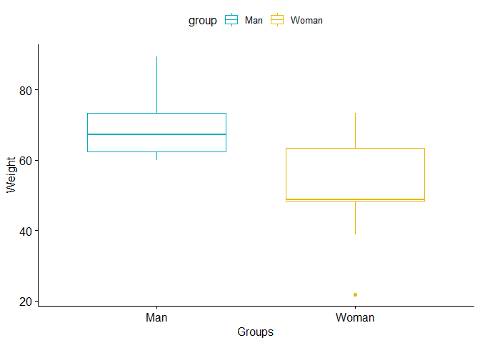
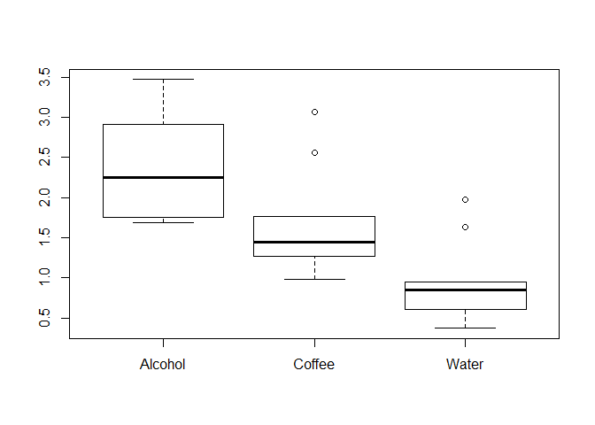
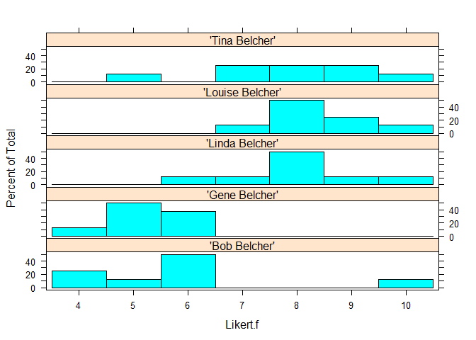

Statistical tests
================

One sample Wilcoxon Test
------------------------

Wilcoxon's rank sum test (also known as the unpaired Wilcoxon rank sum test or the Mann-Whitney U test) It is the test for ordinal or continuous data. In contrast to Student's t-test, does not require the data to be normally distributed. This test too can be used for paired or unpaired data.

Dataset shows different method for identifying protiens and the accuracy.

``` r
load("rdas/protStruct.rda")
head(protStruct)
```

    ##     Protein Method Correct
    ## 1 Ubiquitin  CFAVG   0.467
    ## 2 Ubiquitin    GOR   0.645
    ## 3 Ubiquitin    PHD   0.868
    ## 4   DeoxyHb  CFAVG   0.472
    ## 5   DeoxyHb    GOR   0.844
    ## 6   DeoxyHb    PHD   0.879

``` r
str(protStruct)
```

    ## 'data.frame':    12 obs. of  3 variables:
    ##  $ Protein: Factor w/ 4 levels "DeoxyHb","Prealbumin",..: 4 4 4 1 1 1 3 3 3 2 ...
    ##  $ Method : Factor w/ 3 levels "CFAVG","GOR",..: 1 2 3 1 2 3 1 2 3 1 ...
    ##  $ Correct: num  0.467 0.645 0.868 0.472 0.844 0.879 0.405 0.604 0.787 0.449 ...

Test against a specific hypothesis, mean =0.5

``` r
wilcox.test(protStruct$Correct,mu=0.5) 
```

    ## 
    ##  Wilcoxon signed rank test
    ## 
    ## data:  protStruct$Correct
    ## V = 68, p-value = 0.021
    ## alternative hypothesis: true location is not equal to 0.5

The results of this test concur with the results of the t-test that the central measure (mean or median) of the data differs significantly from 0.5.

Two sample Wilcoxon Rank Sum Tests
----------------------------------

Load the data

Dataset includes info on effectivesness of 2 painkillers as rated by patients

``` r
load("rdas/medrank.rda")
medrank
```

    ##         Drug Score Rank
    ## 1  Oxycodone     1  1.0
    ## 2  Oxycodone     2  2.5
    ## 3  Oxycodone     2  2.5
    ## 4  Oxycodone     3  4.0
    ## 5  Oxycodone     4  6.0
    ## 6  Oxycodone     4  6.0
    ## 7  Oxycodone     5  9.0
    ## 8  Oxycodone     5  9.0
    ## 9  Oxycodone     6 13.0
    ## 10 Oxycodone     6 13.0
    ## 11 Oxycodone     8 21.5
    ## 12 Oxycodone     8 21.5
    ## 13 Ibuprofen     4  6.0
    ## 14 Ibuprofen     5  9.0
    ## 15 Ibuprofen     6 13.0
    ## 16 Ibuprofen     6 13.0
    ## 17 Ibuprofen     6 13.0
    ## 18 Ibuprofen     7 17.5
    ## 19 Ibuprofen     7 17.5
    ## 20 Ibuprofen     7 17.5
    ## 21 Ibuprofen     7 17.5
    ## 22 Ibuprofen     8 21.5
    ## 23 Ibuprofen     8 21.5
    ## 24 Ibuprofen     9 24.0

``` r
group_by(medrank, Drug) %>%
  summarise(
    count = n(),
    medi_score = median(Score, na.rm = TRUE),
    IQR_score = IQR(Score, na.rm = TRUE),
    medi_rank = median(Rank, na.rm = TRUE),
    IQR_rank = IQR(Rank, na.rm = TRUE)
  )
```

    ## # A tibble: 2 x 6
    ##   Drug      count medi_score IQR_score medi_rank IQR_rank
    ##   <fct>     <int>      <dbl>     <dbl>     <dbl>    <dbl>
    ## 1 Ibuprofen    12        7        1.25      17.5     5.5 
    ## 2 Oxycodone    12        4.5      3.25       7.5     9.38

``` r
oxycodone_rank <- medrank$Rank[medrank$Drug=="Oxycodone"]
ibuprofen_rank <- medrank$Rank[medrank$Drug=="Ibuprofen"]
```

Test the 2 drugs

``` r
relation <- wilcox.test(oxycodone_rank, ibuprofen_rank)
```

    ## Warning in wilcox.test.default(oxycodone_rank, ibuprofen_rank): cannot
    ## compute exact p-value with ties

``` r
relation
```

    ## 
    ##  Wilcoxon rank sum test with continuity correction
    ## 
    ## data:  oxycodone_rank and ibuprofen_rank
    ## W = 31, p-value = 0.0181
    ## alternative hypothesis: true location shift is not equal to 0

No difference between the median of 2 groups

Unpaired Wilcoxon Rank Sum Tests
--------------------------------

Load the data

``` r
load("rdas/my_data.rda")
head(my_data)
```

    ##   group weight
    ## 1 Woman   38.9
    ## 2 Woman   61.2
    ## 3 Woman   73.3
    ## 4 Woman   21.8
    ## 5 Woman   63.4
    ## 6 Woman   64.6

``` r
group_by(my_data, group) %>%
  summarise(
    count = n(),
    median = median(weight, na.rm = TRUE),
    IQR = IQR(weight, na.rm = TRUE)
  )
```

    ## # A tibble: 2 x 4
    ##   group count median   IQR
    ##   <fct> <int>  <dbl> <dbl>
    ## 1 Man       9   67.3  10.9
    ## 2 Woman     9   48.8  15

``` r
ggboxplot(my_data, x = "group", y = "weight", 
          color = "group", palette = c("#00AFBB", "#E7B800"),
          ylab = "Weight", xlab = "Groups")
```



### Compute two-samples Wilcoxon test - Method 1

``` r
women_weight <- my_data$weight[my_data$group=="Woman"]
men_weight <- my_data$weight[my_data$group=="Man"]
res <- wilcox.test(women_weight, men_weight)
```

    ## Warning in wilcox.test.default(women_weight, men_weight): cannot compute
    ## exact p-value with ties

``` r
res
```

    ## 
    ##  Wilcoxon rank sum test with continuity correction
    ## 
    ## data:  women_weight and men_weight
    ## W = 15, p-value = 0.02712
    ## alternative hypothesis: true location shift is not equal to 0

### Compute two-samples Wilcoxon test - Method 2

``` r
res <- wilcox.test(weight ~ group, data = my_data,
                   exact = FALSE)
res
```

    ## 
    ##  Wilcoxon rank sum test with continuity correction
    ## 
    ## data:  weight by group
    ## W = 66, p-value = 0.02712
    ## alternative hypothesis: true location shift is not equal to 0

To test whether the median men's weight is less than the median women's weight:

``` r
wilcox.test(weight ~ group, data = my_data, 
            exact = FALSE, alternative = "less")
```

    ## 
    ##  Wilcoxon rank sum test with continuity correction
    ## 
    ## data:  weight by group
    ## W = 66, p-value = 0.9892
    ## alternative hypothesis: true location shift is less than 0

To test whether the median men's weight is greater than the median women's weight

``` r
wilcox.test(weight ~ group, data = my_data,
            exact = FALSE, alternative = "greater")
```

    ## 
    ##  Wilcoxon rank sum test with continuity correction
    ## 
    ## data:  weight by group
    ## W = 66, p-value = 0.01356
    ## alternative hypothesis: true location shift is greater than 0

Pairwise Wilcoxon Rank Sum Tests
--------------------------------

Load the data

``` r
attach(airquality)
head(airquality)
```

    ##   Ozone Solar.R Wind Temp Month Day
    ## 1    41     190  7.4   67     5   1
    ## 2    36     118  8.0   72     5   2
    ## 3    12     149 12.6   74     5   3
    ## 4    18     313 11.5   62     5   4
    ## 5    NA      NA 14.3   56     5   5
    ## 6    28      NA 14.9   66     5   6

``` r
Month <- factor(Month, labels = month.abb[5:9])
```

``` r
pairwise.wilcox.test(Ozone, Month)
```

    ## 
    ##  Pairwise comparisons using Wilcoxon rank sum test 
    ## 
    ## data:  Ozone and Month 
    ## 
    ##     May    Jun    Jul    Aug   
    ## Jun 0.5775 -      -      -     
    ## Jul 0.0003 0.0848 -      -     
    ## Aug 0.0011 0.1295 1.0000 -     
    ## Sep 0.4744 1.0000 0.0060 0.0227
    ## 
    ## P value adjustment method: holm

These give warnings because of ties

``` r
pairwise.wilcox.test(Ozone, Month, p.adj = "bonf")
```

    ## 
    ##  Pairwise comparisons using Wilcoxon rank sum test 
    ## 
    ## data:  Ozone and Month 
    ## 
    ##     May    Jun    Jul    Aug   
    ## Jun 1.0000 -      -      -     
    ## Jul 0.0003 0.1414 -      -     
    ## Aug 0.0012 0.2591 1.0000 -     
    ## Sep 1.0000 1.0000 0.0074 0.0325
    ## 
    ## P value adjustment method: bonferroni

``` r
detach()
```

Krusal Wallis Test
------------------

Load the data

Dataset is about the reaction time taken after intake of 3 different drinks

``` r
load("rdas/reactionR.rda")
str(reactionR)
```

    ## 'data.frame':    30 obs. of  3 variables:
    ##  $ ReactionTime: num  0.37 0.38 0.61 0.78 0.83 0.86 0.9 0.95 0.98 1.11 ...
    ##  $ Drink       : Factor w/ 3 levels "Alcohol","Coffee",..: 3 3 3 3 3 3 3 3 2 2 ...
    ##  $ Rank        : num  1 2 3 4 5 6 7 8 9 10 ...

Medians

``` r
tapply(reactionR$ReactionTime, reactionR$Drink, median)
```

    ## Alcohol  Coffee   Water 
    ##   2.250   1.445   0.845

Summary

``` r
Water_summary<-summary(reactionR$ReactionTime[reactionR$Drink=='Water'])
Coffee_summary<-summary(reactionR$ReactionTime[reactionR$Drink=='Coffee'])
Alcohol_summary<-summary(reactionR$ReactionTime[reactionR$Drink=='Alcohol'])
```

``` r
compare1<-cbind(Water_summary,Coffee_summary,Alcohol_summary)
round(compare1,2)
```

    ##         Water_summary Coffee_summary Alcohol_summary
    ## Min.             0.37           0.98            1.69
    ## 1st Qu.          0.65           1.28            1.77
    ## Median           0.84           1.44            2.25
    ## Mean             0.93           1.64            2.38
    ## 3rd Qu.          0.94           1.68            2.85
    ## Max.             1.97           3.07            3.47

``` r
boxplot(reactionR$ReactionTime~reactionR$Drink)
```



``` r
kruskal.test(reactionR$ReactionTime~reactionR$Drink)
```

    ## 
    ##  Kruskal-Wallis rank sum test
    ## 
    ## data:  reactionR$ReactionTime by reactionR$Drink
    ## Kruskal-Wallis chi-squared = 16.322, df = 2, p-value = 0.0002856

The simplest adjustment is the Bonferroni adjustment p.adj='bonferroni' which multiplies each Wilcoxon signed rank p-value by the total number of Wilcoxon tests being carried out (here it is 3) while the exact=F stands for the asymptotic test which allows tied ranks.

Look for which drinks are

``` r
pairwise.wilcox.test(reactionR$ReactionTime,reactionR$Drink,p.adj='bonferroni',exact=F)
```

    ## 
    ##  Pairwise comparisons using Wilcoxon rank sum test 
    ## 
    ## data:  reactionR$ReactionTime and reactionR$Drink 
    ## 
    ##        Alcohol Coffee
    ## Coffee 0.042   -     
    ## Water  0.002   0.027 
    ## 
    ## P value adjustment method: bonferroni

Friedman Test
-------------

Load the data

``` r
load("rdas/Data.rda")
str(Data)
```

    ## 'data.frame':    40 obs. of  3 variables:
    ##  $ Instructor: Factor w/ 5 levels "'Bob Belcher'",..: 1 1 1 1 1 1 1 1 3 3 ...
    ##  $ Rater     : Factor w/ 8 levels "a","b","c","d",..: 1 2 3 4 5 6 7 8 1 2 ...
    ##  $ Likert    : int  4 5 4 6 6 6 10 6 8 6 ...

``` r
Data$Likert.f <- as.factor(Data$Likert)
XT <- xtabs( ~ Instructor + Likert.f,
             data = Data)
XT
```

    ##                   Likert.f
    ## Instructor         4 5 6 7 8 9 10
    ##   'Bob Belcher'    2 1 4 0 0 0  1
    ##   'Gene Belcher'   1 4 3 0 0 0  0
    ##   'Linda Belcher'  0 0 1 1 4 1  1
    ##   'Louise Belcher' 0 0 0 1 4 2  1
    ##   'Tina Belcher'   0 1 0 2 2 2  1

As proportions

``` r
prop.table(XT, 
           margin = 1)
```

    ##                   Likert.f
    ## Instructor             4     5     6     7     8     9    10
    ##   'Bob Belcher'    0.250 0.125 0.500 0.000 0.000 0.000 0.125
    ##   'Gene Belcher'   0.125 0.500 0.375 0.000 0.000 0.000 0.000
    ##   'Linda Belcher'  0.000 0.000 0.125 0.125 0.500 0.125 0.125
    ##   'Louise Belcher' 0.000 0.000 0.000 0.125 0.500 0.250 0.125
    ##   'Tina Belcher'   0.000 0.125 0.000 0.250 0.250 0.250 0.125

``` r
histogram(~ Likert.f | Instructor,
          data=Data,
          layout=c(1,5)      #  columns and rows of individual plots
)
```



``` r
friedman.test(Likert ~ Instructor | Rater,
              data = Data)
```

    ## 
    ##  Friedman rank sum test
    ## 
    ## data:  Likert and Instructor and Rater
    ## Friedman chi-squared = 23.139, df = 4, p-value = 0.0001188

Also done as

``` r
friedman.test(Data$Likert, Data$Instructor, Data$Rater)
```

    ## 
    ##  Friedman rank sum test
    ## 
    ## data:  Data$Likert, Data$Instructor and Data$Rater
    ## Friedman chi-squared = 23.139, df = 4, p-value = 0.0001188

``` r
Ratertable <- xtabs(Likert ~ Instructor + Rater, 
                    data = Data)
```

Can do rowmeans of ratertable to see the difference in mean ratings,the diff is tested statistically by friedmantest

### Conover test

``` r
PT = posthoc.friedman.conover.test(y      = Data$Likert,
                                   groups = Data$Instructor,
                                   blocks = Data$Rater,
                                   p.adjust.method="fdr")
PT
```

    ## 
    ##  Pairwise comparisons using Conover's test for a two-way 
    ##                     balanced complete block design 
    ## 
    ## data:  Data$Likert , Data$Instructor and Data$Rater 
    ## 
    ##                  'Bob Belcher' 'Gene Belcher' 'Linda Belcher'
    ## 'Gene Belcher'   0.17328       -              -              
    ## 'Linda Belcher'  2.8e-05       1.2e-06        -              
    ## 'Louise Belcher' 1.9e-06       1.1e-07        0.27303        
    ## 'Tina Belcher'   0.00037       8.8e-06        0.31821        
    ##                  'Louise Belcher'
    ## 'Gene Belcher'   -               
    ## 'Linda Belcher'  -               
    ## 'Louise Belcher' -               
    ## 'Tina Belcher'   0.05154         
    ## 
    ## P value adjustment method: fdr
