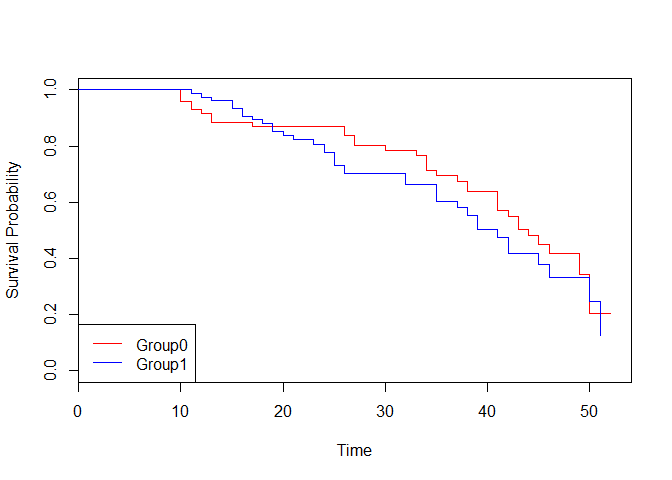

Survival Analysis
================

``` r
load("rdas/survival.rda")
head(survival)
```

    ##   Group Outcome Time
    ## 1     1       0   50
    ## 2     0       0   26
    ## 3     1       0   37
    ## 4     0       0   12
    ## 5     1       0   28
    ## 6     1       0   44

``` r
str(survival)
```

    ## 'data.frame':    150 obs. of  3 variables:
    ##  $ Group  : int  1 0 1 0 1 1 0 1 1 1 ...
    ##  $ Outcome: int  0 0 0 0 0 0 0 0 0 0 ...
    ##  $ Time   : int  50 26 37 12 28 44 46 45 27 26 ...

``` r
summary(survival)
```

    ##      Group           Outcome          Time     
    ##  Min.   :0.0000   Min.   :0.00   Min.   :10.0  
    ##  1st Qu.:0.0000   1st Qu.:0.00   1st Qu.:22.0  
    ##  Median :1.0000   Median :0.00   Median :34.0  
    ##  Mean   :0.5267   Mean   :0.48   Mean   :31.7  
    ##  3rd Qu.:1.0000   3rd Qu.:1.00   3rd Qu.:42.0  
    ##  Max.   :1.0000   Max.   :1.00   Max.   :52.0

### Kaplan-Meier non-parametric analysis

``` r
kmsurvival <- survfit(Surv(survival$Time, survival$Outcome) ~1)
summary(kmsurvival)
```

    ## Call: survfit(formula = Surv(survival$Time, survival$Outcome) ~ 1)
    ## 
    ##  time n.risk n.event survival std.err lower 95% CI upper 95% CI
    ##    10    150       3    0.980  0.0114       0.9578        1.000
    ##    11    144       3    0.960  0.0162       0.9284        0.992
    ##    12    140       2    0.946  0.0186       0.9101        0.983
    ##    13    135       3    0.925  0.0218       0.8831        0.969
    ##    15    130       2    0.911  0.0237       0.8654        0.958
    ##    16    128       2    0.896  0.0254       0.8481        0.947
    ##    17    126       2    0.882  0.0269       0.8310        0.936
    ##    18    122       1    0.875  0.0276       0.8225        0.931
    ##    19    121       2    0.860  0.0290       0.8055        0.919
    ##    20    116       1    0.853  0.0297       0.7968        0.913
    ##    21    114       1    0.846  0.0303       0.7882        0.907
    ##    23    110       1    0.838  0.0310       0.7792        0.901
    ##    24    109       2    0.823  0.0323       0.7616        0.888
    ##    25    106       3    0.799  0.0341       0.7352        0.869
    ##    26    100       4    0.767  0.0363       0.6994        0.842
    ##    27     94       2    0.751  0.0373       0.6813        0.828
    ##    30     86       1    0.742  0.0379       0.6716        0.820
    ##    32     83       2    0.724  0.0390       0.6518        0.805
    ##    33     78       1    0.715  0.0396       0.6415        0.797
    ##    34     76       3    0.687  0.0412       0.6106        0.773
    ##    35     72       4    0.649  0.0431       0.5694        0.739
    ##    37     63       2    0.628  0.0442       0.5472        0.721
    ##    38     58       3    0.596  0.0457       0.5124        0.692
    ##    39     54       2    0.574  0.0466       0.4891        0.672
    ##    41     47       4    0.525  0.0486       0.4376        0.629
    ##    42     42       3    0.487  0.0497       0.3989        0.595
    ##    43     36       2    0.460  0.0505       0.3711        0.571
    ##    44     34       1    0.447  0.0508       0.3574        0.558
    ##    45     27       2    0.414  0.0521       0.3230        0.529
    ##    46     22       2    0.376  0.0537       0.2841        0.498
    ##    49     15       2    0.326  0.0571       0.2311        0.459
    ##    50      9       3    0.217  0.0638       0.1222        0.386
    ##    51      4       1    0.163  0.0671       0.0727        0.365

``` r
plot(kmsurvival, xlab="Time", ylab="Survival Probability")
```


### Kaplan-Meier non-parametric analysis by group

``` r
kmsurvival_grp <- survfit(Surv(survival$Time, survival$Outcome) ~ survival$Group)
summary(kmsurvival_grp)
```

    ## Call: survfit(formula = Surv(survival$Time, survival$Outcome) ~ survival$Group)
    ## 
    ##                 survival$Group=0 
    ##  time n.risk n.event survival std.err lower 95% CI upper 95% CI
    ##    10     71       3    0.958  0.0239       0.9121        1.000
    ##    11     67       2    0.929  0.0305       0.8712        0.991
    ##    12     64       1    0.915  0.0333       0.8516        0.982
    ##    13     61       2    0.885  0.0384       0.8125        0.963
    ##    17     59       1    0.870  0.0406       0.7937        0.953
    ##    26     52       2    0.836  0.0454       0.7518        0.930
    ##    27     49       2    0.802  0.0495       0.7106        0.905
    ##    30     47       1    0.785  0.0513       0.6906        0.892
    ##    33     44       1    0.767  0.0532       0.6697        0.879
    ##    34     42       3    0.712  0.0580       0.6072        0.836
    ##    35     39       1    0.694  0.0594       0.5870        0.821
    ##    37     37       1    0.675  0.0606       0.5664        0.805
    ##    38     35       2    0.637  0.0630       0.5245        0.773
    ##    41     29       3    0.571  0.0670       0.4536        0.719
    ##    42     26       1    0.549  0.0679       0.4307        0.700
    ##    43     24       2    0.503  0.0695       0.3838        0.660
    ##    44     22       1    0.480  0.0700       0.3609        0.639
    ##    45     16       1    0.450  0.0718       0.3294        0.616
    ##    46     14       1    0.418  0.0735       0.2962        0.590
    ##    49     11       2    0.342  0.0774       0.2196        0.533
    ##    50      5       2    0.205  0.0882       0.0885        0.476
    ## 
    ##                 survival$Group=1 
    ##  time n.risk n.event survival std.err lower 95% CI upper 95% CI
    ##    11     77       1    0.987  0.0129       0.9620        1.000
    ##    12     76       1    0.974  0.0181       0.9391        1.000
    ##    13     74       1    0.961  0.0222       0.9184        1.000
    ##    15     71       2    0.934  0.0286       0.8793        0.992
    ##    16     69       2    0.907  0.0336       0.8432        0.975
    ##    17     67       1    0.893  0.0357       0.8259        0.966
    ##    18     64       1    0.879  0.0378       0.8082        0.956
    ##    19     63       2    0.851  0.0414       0.7739        0.937
    ##    20     59       1    0.837  0.0432       0.7564        0.926
    ##    21     57       1    0.822  0.0448       0.7389        0.915
    ##    23     55       1    0.807  0.0464       0.7212        0.904
    ##    24     54       2    0.777  0.0493       0.6865        0.880
    ##    25     51       3    0.732  0.0530       0.6348        0.843
    ##    26     48       2    0.701  0.0550       0.6012        0.818
    ##    32     37       2    0.663  0.0582       0.5585        0.788
    ##    35     33       3    0.603  0.0625       0.4922        0.739
    ##    37     26       1    0.580  0.0642       0.4666        0.720
    ##    38     23       1    0.555  0.0662       0.4389        0.701
    ##    39     22       2    0.504  0.0691       0.3854        0.660
    ##    41     18       1    0.476  0.0707       0.3559        0.637
    ##    42     16       2    0.417  0.0733       0.2951        0.588
    ##    45     11       1    0.379  0.0758       0.2558        0.561
    ##    46      8       1    0.331  0.0798       0.2068        0.531
    ##    50      4       1    0.249  0.0934       0.1190        0.519
    ##    51      2       1    0.124  0.0995       0.0259        0.597

``` r
plot(kmsurvival_grp,conf.int=FALSE,col=c("Red","Blue"),xlab="Time", ylab="Survival Probability")
legend("bottomleft", c("Group0", "Group1"), col=c("Red","Blue"), lty = 1)
```



### Cox proprtional hazard model - coefficients and hazard rates

``` r
coxph <- coxph(Surv(survival$Time, survival$Outcome) ~ survival$Group, method = "breslow")
summary(coxph)
```

    ## Call:
    ## coxph(formula = Surv(survival$Time, survival$Outcome) ~ survival$Group, 
    ##     method = "breslow")
    ## 
    ##   n= 150, number of events= 72 
    ## 
    ##                  coef exp(coef) se(coef)     z Pr(>|z|)
    ## survival$Group 0.2313    1.2603   0.2381 0.971    0.331
    ## 
    ##                exp(coef) exp(-coef) lower .95 upper .95
    ## survival$Group      1.26     0.7935    0.7903      2.01
    ## 
    ## Concordance= 0.533  (se = 0.034 )
    ## Rsquare= 0.006   (max possible= 0.982 )
    ## Likelihood ratio test= 0.94  on 1 df,   p=0.3
    ## Wald test            = 0.94  on 1 df,   p=0.3
    ## Score (logrank) test = 0.95  on 1 df,   p=0.3
